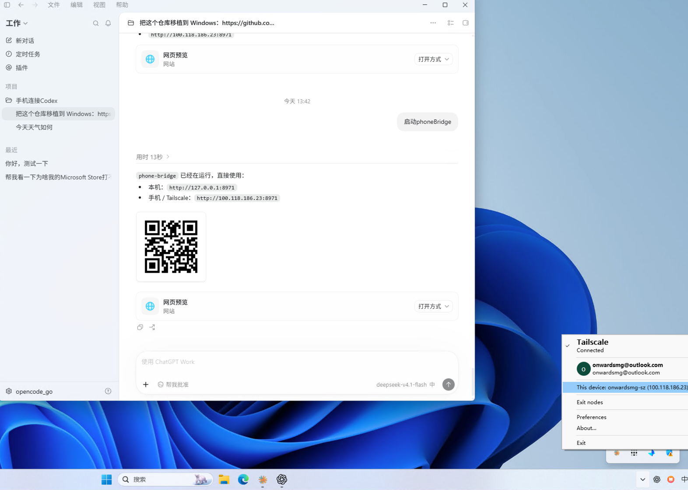
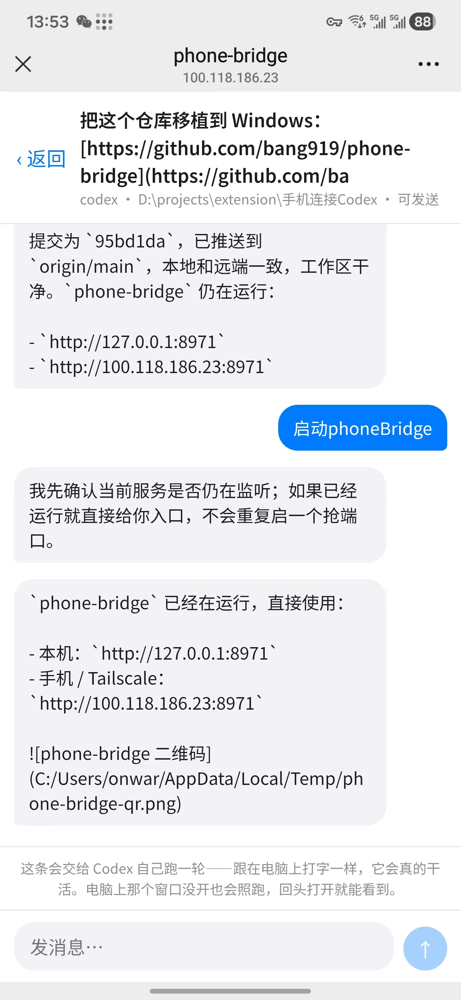

# phone-bridge

扫一下码，把桌面版 AI 的对话接管到手机上。**不装 App**，手机端就一个网页。

出门吃个饭、上趟厕所、走远一点，还想盯着电脑上正在跑的任务，就掏出手机接着看、
接着发。Codex 和 Claude Code 都能接管，**目前只有纯文字这一版**。

| 电脑端 | 手机端 |
|:---:|:---:|
|  |  |
| 电脑上开好 Tailscale，让 AI 起一次 phone-bridge，地址和二维码就出来了 | 手机扫码打开，同一个会话原样回到手上 |

## 原理，一句话

手机端不装 App、不登录，是因为它压根没直连官方 API，两头都借的是本机：

- **看**：直接读 Codex / Claude Code 写在本机的会话日志。
- **发**：借 Codex 桌面版和 Claude Code **内部预留、没有对外公开的通道**
  （通俗说就是内部后门），把消息原样塞回那个正在跑的会话里，跟在电脑上打字一样。

走的是人家私有的口子、不是公开 API，所以**有时效性、随时可能失效**：官方哪天改了实现、
或者把口子收掉，这个项目就不灵了。当个顺手的小工具用，别当长期依赖。

另外，这是个**用 AI 写的、给自己用的小软件**：能用就行，没做兼容性承诺，也没打算做成产品。

## 怎么用

1. **先开 [Tailscale](https://tailscale.com/download)，这一步是必须的。** 电脑和手机登录
   **同一个账号**，才会有那条能跨网络的私有地址（`100.x.x.x`）。

2. **让 AI 把服务起起来。** 在 Claude Code / Codex 里说一句「启动 phone-bridge」就行；
   也可以自己跑：

   ```bash
   python bridge.py --port 8971
   ```

3. **拿到地址和二维码。** 服务会把两个地址打印出来（本机 `http://127.0.0.1:8971`、
   Tailscale `http://100.x.x.x:8971`），并生成一张二维码图片。缺 `qrcode` 包会自动装上。

   > **Windows 必须从普通 PowerShell / 终端启动。** 如果从受限工具沙箱启动，
   > `bridge.py` 调用 `codex queue` 时会继承写入限制，手机发送报
   > `state_5.sqlite ... readonly database`。这不是 Codex 会话坏了，换到普通
   > 终端重启 bridge 即可。

4. **手机扫码打开。** 手机上装好 Tailscale、登录同一账号，扫那张码，或者手输那个
   `100.x.x.x:8971` 地址。

就这样。手机上能看到全部对话，也能发消息。

> 没装 Tailscale 时服务会退到**局域网**地址，同一个 wifi 下也能连。但那样**同一个网络里
> 谁都打得开它**（服务没有密码），所以在咖啡馆、酒店、公司网里别这么用——先把 Tailscale
> 装好，那才是推荐的姿势。

## 现在能做什么

| | 看 | 发 |
|---|---|---|
| Claude | ✅ | ✅ |
| Codex | ✅ | ✅ |

Codex 只有**桌面版开的**会话能发（终端里跑的接不进去）。发出去是让 Codex
真的跑一轮，跟在电脑上打字一样——**电脑上那个窗口没开也会跑**，回头打开就能看到。

目前只做了**纯文字**这一版：能看、能发消息，没有语音、没有图片、没有推送。够用就行。

## 注意

- **macOS 和 Windows 都支持。**
  - macOS 的 Claude 入站走 UDS，并受会话进程树认证；别的会话需要启动中继。
  - Windows 的 Claude 入站走命名管道，用会话自己的 token 认证；拿得到 token 的 bridge
    可以直接写入所有支持 peer messaging 的活动会话，**不需要中继**。
  - Codex 在两个平台都走桌面版自带的 `codex queue`。
- 手机上发的话**不算你的「批准」**。日常接着聊没问题；涉及危险操作、边界、权限的，别指望手机上这一句能通过。
- 服务**没有密码**，所以优先走 Tailscale 内网。没装 Tailscale 时会退到局域网地址
  （同一个 wifi 下谁都能开）——**别往公网暴露**。

macOS 上，Claude 只有**正在跑、并且起了中继**的对话能发；点灰掉的会话会提示在
对应对话里启动 phone-bridge。Windows 上 Claude 有活动进程、管道和 token 就能发，
不需要逐个启动中继。没在跑的历史对话在两个平台都只能看。

## 安装

```bash
git clone https://github.com/bang919/phone-bridge.git ~/.claude/skills/phone-bridge
```

只依赖系统自带的 python3。二维码要一个 `qrcode` 包，**没装的话服务启动时会自己装**
（`pip install --user`，装之前会先说一声）；万一装不上，也会明确告诉你少的是什么，
不会默默少一张图。想提前装好：

```bash
pip install qrcode
```

## 更多

- [SKILL.md](SKILL.md) —— 给 Claude Code 用的完整说明：架构、陷阱、UI 约定、排错
- [PORTING.md](PORTING.md) —— **接一个新 App 之前先读**：从零逆一套通道的通用方法
